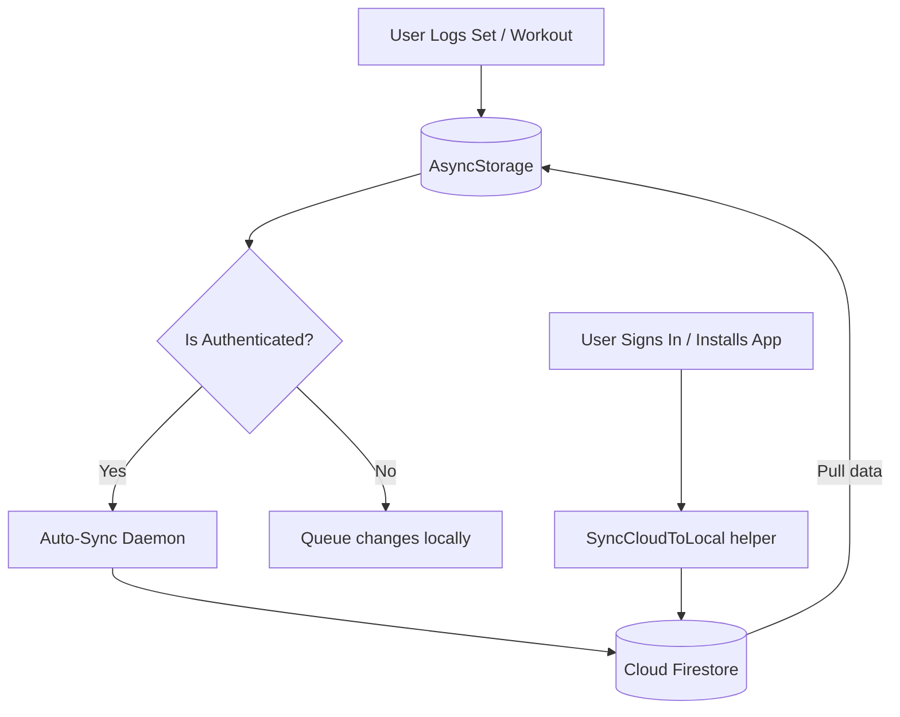

# <p align="center"><br>CONQUER ONE</p>

<p align="center">
  <strong>Elite dumbbell training protocol. Engineered for performance.</strong>
</p>

<p align="center">
  
  
  
  
  
</p>

---

## ⚡ Overview

**CONQUER ONE** is a premium, offline-first 6-day dumbbell split training application built using React Native and Expo. Tailored for athletes who demand maximum performance, it combines a tactical dark mode and crimson design language with robust cloud synchronization, Health Connect integration, local caching, and custom AI-driven coaching powered by the Google Gemini API.

> [!IMPORTANT]
> This project is designed as a standalone, distraction-free companion to serious lifting routines. No social bloat, no subscription walls—just raw performance, precise timers, and automated progression records.

---

## 🎨 Visual Identity

The interface adheres to an **cyber-athletic** design system:
- **Primary Canvas:** Deep Space Black (`#0A0A0F`)
- **Accent Theme:** Crimson Red (`#C8202A` / `#E31E24`)
- **Glassmorphism:** Tinted overlays with subtle borders (`rgba(255,255,255,0.03)`) for high readability in gym environments.
- **Typography:** Modern tech fonts including *Outfit*, *Urbanist*, *Syne*, and *Arimo*.
- **Icon Artwork:** TWISTED BICEP logo enhanced with a custom outer red aura glow, scaled perfectly within the native squircle mask to avoid edge clipping.

---

## 🚀 Key Features

### 🏋️‍♂️ Core Training Engine
*   **6-Day Structured Split:** chest, back, arms, abs & forearms, shoulders, and legs.
*   **Intelligent Rest Overlay:** Displays current set progression (e.g. `SET 01 / 03`) with interactive tracking dots and "Upcoming Exercise" cards between movements.
*   **Recent Workout Logs:** Live, inline card during active workouts displaying set, rep, and weight records from your *previous* session of that exact exercise.
*   **Side-Isolated Tracking:** Full unilateral exercise logging, letting you track and balance the left and right sides independently.
*   **Flexible Progression:** Jump-to-exercise navigation to skip around mid-workout, plus a custom workout builder to design your own daily protocols.

### 📊 Performance & Analytics
*   **Auto PR Detection:** Automatically detects, stores, and celebrates new Personal Records (PRs) upon set completion.
*   **Body Metrics Tracker:** Long-term tracking for body weight, chest, waist, hips, biceps, and thighs with native visualization.
*   **Rank Progression System:** Gain experience points (XP) and unlock badges from Recruit to Legend.
*   **CSV Exports:** Easily download your local history as a structured CSV for spreadsheet analytics.

### 🧠 Experience & Technical Architecture
*   **Gemini AI Coach:** On-demand workout advice and form analysis with multi-model fallback routines.
*   **Smart Streak System:** Encourages consistency with built-in freeze protections for rest/travel days.
*   **Offline-First & Auto Sync:** Complete offline availability via AsyncStorage. Upon login, a background service auto-synchronizes and reconciles local states with Cloud Firestore.
*   **Voice Guidance & Haptics:** Hands-free TTS voice cues and custom haptic feedback for set milestones, PR celebrations, and rest timers.

---

## ⚙️ Tech Stack

| Layer | Technologies |
|---|---|
| **Frontend Framework** | React Native 0.81 · Expo SDK 54 |
| **State & Navigation** | React Navigation v7 (Stack) |
| **Authentication** | Firebase Auth v12 (Email + Google Sign-In) |
| **Database** | Cloud Firestore (Structured collections) |
| **Local Storage** | AsyncStorage (SQLite-backed local persistence) |
| **AI Integration** | Google Gemini API (Fallback configuration) |
| **Device Integration** | React Native Health Connect (Steps & MET Calorie burn) |
| **Updates & Deploy** | Expo EAS CLI & OTA Updates (Preview/Production channels) |

---

## 📂 Architecture

```
/
├── App.js                     # Root configuration: fonts, OTA update checks, Auth routing
├── app.json                   # Expo configuration & native permissions (Health Connect, Android settings)
├── eas.json                   # Build configs (development, preview APKs, production)
├── firestore.rules            # Security constraints for Firestore collections
├── src/
│   ├── screens/               # Screen components (workout, progress, history, stats, AI coach)
│   ├── components/            # Reusable UI widgets (NetworkBanner, DayIcon, WorkoutChart, RestOverlay)
│   ├── context/               # AuthContext.js (Session state, auto-cache sync, user hydration)
│   ├── data/                  # workoutData.js (Bilateral splits, rep ranges, tips, target muscles)
│   └── utils/
│       ├── firebase.js        # Core Firebase configuration & initialization
│       ├── firestore.js       # Cloud DB reads/writes (user profiles, history logs, streaks)
│       ├── storage.js         # AsyncStorage offline storage wrapper & cloud hydration
│       ├── sync.js            # Sync engine linking local history to Cloud Firestore
│       ├── gemini.js          # Google Gemini AI connection & fallback orchestration
│       ├── audio.js           # Voice synthesis (Expo Speech) helper functions
│       ├── health.js          # Android Health Connect reads (active energy, daily steps)
│       ├── notifications.js   # Local notification triggers (reminders, streak alerts)
│       ├── settings.js        # User app preferences
│       └── theme.js           # Design tokens (colors, font families, shadows, sizes)
```

### Data Synchronization Flow



---

## 🛠️ Getting Started

### Prerequisites
*   Node.js ≥ 20.x
*   Expo CLI globally installed: `npm install -g eas-cli`
*   Android Studio (for Android Emulator) or Xcode (for iOS Simulator)
*   *Note: Health Connect features require a physical Android 14+ device.*

### Installation
1.  Clone the repository:
    ```bash
    git clone https://github.com/vivaswanshetty/ConquerONE.git
    cd ConquerONE
    ```
2.  Install dependencies:
    ```bash
    npm install
    ```

### Environment Configuration
Create a `.env` file in the root directory:
```env
EXPO_PUBLIC_GEMINI_API_KEY=your_google_gemini_api_key_here
```
> [!TIP]
> You can acquire a free or pay-as-you-go Gemini API key from [Google AI Studio](https://aistudio.google.com/).

### Firebase Setup
1.  Create a project on the [Firebase Console](https://console.firebase.google.com/).
2.  Enable **Email/Password** and **Google Sign-In** under Authentication.
3.  Deploy the Firestore database in production mode.
4.  Copy your config block into `src/utils/firebase.js`.
5.  Apply the security rules found in `firestore.rules`.

### Running Locally
```bash
# Start Metro bundler
npm start

# Launch on Android Emulator/Device
npm run android

# Launch on iOS Simulator
npm run ios
```

---

## 📦 Building & Deploying

### Generate Test APK (Preview)
To compile a native Android APK build for internal distribution:
```bash
eas build --profile preview --platform android
```

### Over-The-Air (OTA) Updates
Publish updates instantly to active installations without submitting new app store builds:
```bash
# Push update to the preview testing channel
npm run update -- --message "Update details"

# Push update to the production channel
npm run update:prod -- --message "Release build hotfix"
```

---

## 🔒 Firestore Security Rules
The database is fully locked down so users can only read or write to their own private profile collections:
```javascript
rules_version = '2';
service cloud.firestore {
  match /databases/{database}/documents {
    match /users/{userId} {
      allow read, write: if request.auth != null && request.auth.uid == userId;
      match /{subcollection}/{docId} {
        allow read, write: if request.auth != null && request.auth.uid == userId;
      }
    }
  }
}
```

---

## 🏆 Rank Thresholds
Track your dedication and rise through the ranks:

| Session Count | Rank Level |
| :--- | :--- |
| **0 – 4** | 🎖️ RECRUIT |
| **5 – 9** | ⚔️ ROOKIE |
| **10 – 24** | 🌟 RISING STAR |
| **25 – 49** | ⚡ WARRIOR |
| **50 – 99** | 🔥 TITAN |
| **100+** | 👑 LEGEND |

---

## 📜 License
This project is licensed under the MIT License - see the `LICENSE` file for details.

---

<p align="center">
  <b>BUILT FOR POWER BY VIVASWAN SHETTY</b><br>
  <code>CONQUER ONE CORE PROTOCOL v2.3.0</code>
</p>
